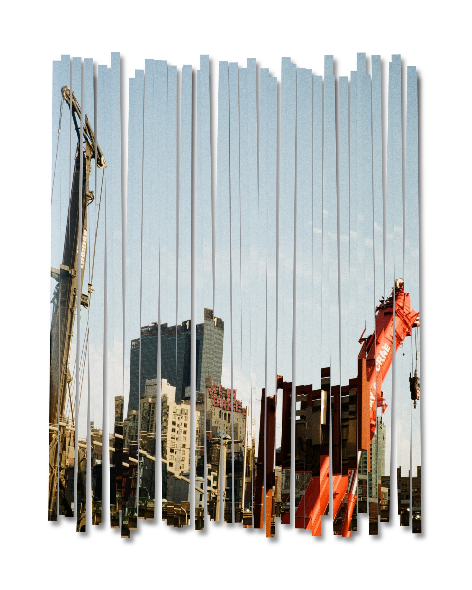

# LOUVER

Cut photographs into paper strips and put them back together.

LOUVER is a browser tool for the kind of image you would otherwise make with a scalpel, a cutting mat and an afternoon: slice a photo into strips, shuffle them, let them overlap, tear the edges, give them a little shadow, and print the result. Everything runs in your browser — no upload, no account, no server.

**Use it here: https://z-tfs.github.io/LOUVER/**

---

## Sources

Add one image or several, as JPG or PNG — through *Add images* or by dropping files onto the canvas. A generated placeholder is there when you open the tool and is replaced by the first file you add.

Each source carries its own settings. Selecting a source in the list switches every panel below to that source's values, so two photos in the same composition can be cut differently, arranged differently and given different paper and shadow. New sources inherit the settings of the one that was active when you added them.

**Framing.** *Image size* sets how much of the canvas the photo covers: 1.00 fills it, below 1.00 leaves paper around it, and strips only exist where the photo actually is. *Fill* and *Fit* jump to the two obvious values. *Adjust* turns on framing mode — drag to move the photo, scroll to resize.

**Cutting.** Horizontal, vertical or any angle from 0 to 180°. Set the count directly or drag *Strip width*; the two stay in sync. Edges are either straight or torn, with a roughness slider. Torn edges are regenerated at your current zoom, so enlarging a strip shows more fibre rather than a magnified wobble, and two strips that were cut apart still fit back together.

**Black & white** converts that source before cutting.

## Canvas

Preset ratios (1:1, 3:4, 4:5, 9:16, 2:1) or a custom ratio.

## Sequence

Every source is cut completely and all its strips are kept — nothing is discarded. The sequence decides which source sits **on top** at each strip position, repeating down the stack. `1-2` weaves two photos strip by strip; `1-1-2` lets the first dominate and lets the second surface every third strip. Individual strips can still be reordered afterwards.

## Arrange

- **Shuffle** throws the strips into a random overlap. **Overlap** then scales that same arrangement live, from tidy to scattered, and every shuffle draws a fresh one — no seeds, no repeats.
- **Gap** spaces strips apart or pushes them into each other; negative values overlap.
- **Group size** and **Group offset** scale and move the whole set of strips inside the canvas.
- **Auto tile** offers four regular patterns — alternate, cascade, fan, weave.
- **Apply to all** copies these settings to every source.

## Editing strips by hand

Click a strip to select it; drag to move, and use the handles to rotate, scale from a corner, or stretch from an edge. Hold **Shift** while rotating to snap to 15°.

Multiple strips:

| | |
|---|---|
| Add to the selection | **Shift**-click, or **Shift**-drag a box |
| Remove from it | **Alt**-click, or **Alt**-drag a box |
| Replace the selection | drag a box from empty space, or just click |
| Select all / none | **⌘A** / **Esc** |

A multiple selection moves, rotates and scales as a block, keeping the strips' relative positions. Edge stretching stays single-strip only, since strips at different angles cannot share a non-uniform scale.

**Layer order** follows Illustrator: **⌘]** forward, **⌘[** backward, add **Shift** to send all the way to front or back. Right-click any strip for the same commands, plus reset and remove. Arrow keys nudge, **Shift** + arrows nudge further, **Delete** removes. The Layers panel lists every strip top to bottom and accepts the same Shift / Alt clicks.

## Surface

Paper grain or one of two fibre textures, light and dark, laid over the photo in a blend mode of your choice rather than replacing its colour. Shadows have their own colour, blend mode, opacity, offset and blur. The canvas sits on a paper-coloured background you can set or switch off. Like Arrange, these belong to the selected source and can be copied to all.

## Wind

Blow on the composition and watch the strips lift off the page. Choose where every strip is **pinned** — its start (the left end of a horizontal strip, the top of a vertical one), middle, end, both ends, or along one long edge like a louver blade — then set the wind's **direction**, **strength**, **gusts** and how stiff the paper is. Hover over the Wind panel to see the pins and a wind arrow on the canvas.

The strips are treated as thin sheets in 3D: they bend, twist and turn over, and wherever one turns over you see the back of the paper (its colour is yours to set). They are shaded by how they face the light, grow slightly as they rise toward you, and cast shadows that drift and soften with height — onto the page and onto each other. Strips keep their stacking where they overlap: a strip that lies under another lifts it rather than passing through it, and what is in front is decided point by point, so crossings don't flicker. **Selected strips only** blows just the current selection. **Freeze** holds a moment; exporting while the wind blows or is frozen captures exactly that moment. **Stop** lets the strips settle back flat into the composition you left, and canvas editing resumes; **Reset** lays them flat at once. The pins are hidden while the wind blows or is frozen.

## Export

PNG or JPG, at any width up to 12000px, with the DPI written into the file so 300 dpi print sizes land correctly — the panel shows the physical size in inches as you change it. PNG can keep a transparent background. Black and white is a separate switch here, so you can work in colour and export in grey, or the reverse. The export is re-rendered from the original files at full resolution; it is never a scaled-up screenshot of the preview.

## Project

Undo and redo go back 30 steps (**⌘Z** / **⌘⇧Z**). Saving stores the whole editing state — sources, cuts, positions, textures, layer order — in your browser, so you can reopen and keep working. Saves stay in that one browser on that one machine and are visible to nobody else.

---

## Running it yourself

The whole tool is a single file, `index.html`, with no build step and no dependency beyond a web font. Download it and open it in a browser, or host it anywhere static files are served.

## License

[MIT](LICENSE). The sample image is a photograph by the author.
